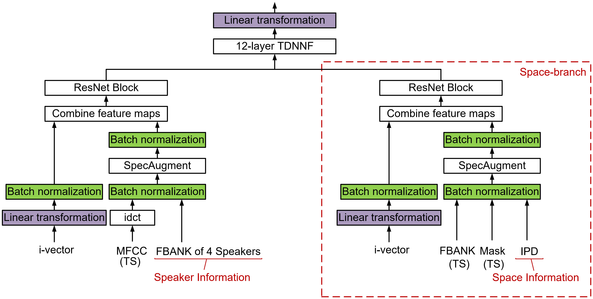

# **Space-and-Speaker-Aware Acoustic Modeling with Effective Data Augmentation for Recognition of Multi-Array Conversational Speech**

<p align="center">
  <a href="https://github.com/coalboss/SSA_AM/blob/main/LICENSE"></a>
  <a href="https://github.com/coalboss/SSA_AM"></a>
  <a href="https://github.com/coalboss"></a>
</p>

<span id="nav-1"></span>

<div align="center"></div>

This repository provides a official implementation of our champion system of Track 1 of the CHiME-6 Challenge. 

## **Citation**

If you find this code useful in your research, please consider to cite the following papers:

```bibtex
@inproceedings{chai2023ssa,
  author={Li Chai and Hang Chen and Jun Du and Qing-Feng Liu and Chin-Hui Lee},
  title={Space-and-Speaker-Aware Acoustic Modeling with Effective Data Augmentation for Recognition of Multi-Array Conversational Speech},
  booktitle={},
  pages={},
  year={},
  organization={}
}
```

## **Introduction**

  Our system is largely based on [the baseline system in Kaldi](https://github.com/kaldi-asr/kaldi/tree/master/egs/chime6/s5b_track1), with updated training data and acoustic model. To use our system, researchers must first prepare the data (including i-vector) and train the GMM-HMM model using the baseline system, following the instructions provided in the Kaldi repository. Once this is done, they can copy our code to the baseline folder and run it using the instructions provided in our repository.

## **Training Data Preparation**

  - **GSS-enhanced and worn data**

    Same as in the baseline.
  
  - **SSA-IME-enhanced data (<font color='red'> preparing... </font>)**
    
  <div align="center"></div>

## **Feature Extraction**

  - **MFCC extraction**

    Same as in the baseline.

  - **I-vector extraction**
  
    Same as in the baseline.
  
  - **IPD feature extraction**

    We use a relased script, you can find more details in [here](https://github.com/kooBH/DSS/blob/af512252567030c56c52cd83bd73180cedaf64d8/src/feature.py).

    
    
## **Acoustic Model Architectures**

<div align="center"></div>

We proposed 4 acoustic model architectures ResNet-TDNNF, ResNet-TDNNF-Dilation, ResNetSelfAttention-TDNNF-Dilation and ResNet-TDNN-RBiLSTM.

- **ResNet-TDNNF**


```
bash run_Resnet_12ftdnndim2048bn512_firstBN1024_SpecAugment_Epoch6.sh --stage 11
```

- **ResNet-TDNNF-Dilation**

```
bash run_Resnet_12ftdnndim2048bn512_firstBN1024_SpecAugment_Epoch6_dialation.sh --stage 11
```

- **ResNetSelfAttention-TDNNF-Dilation**

```
bash run_Resnet_selfattention_12ftdnndim2048bn512_firstBN1024_SpecAugment_Epoch6_dilation.sh --stage 11
```

- **ResNet-TDNN-RBiLSTM**

```
bash run_Resnet_tdnn_Resbilstm_projectlayer512_SpecAugment_Epoch6.sh --stage 11
```

## **Space-and-Speaker-Aware Acoustic Modeling**

<div align="center"></div>

The above acoustic models only use the fbank features extracted from the target speaker as the inputs. One of the highlights in this system is the Space-and-Speaker-Aware Acoustic Modeling (SSA-AM) approach which exploits the speaker information from both target and interfering speakers and space information between different speakers for acoustic modeling. These features are concatenated together serving as the inputs.

```
bash run_Resnet_tdnnf_SSA.sh --stage 11
```

## **Results**

- **WER(in %) results on the evaluation data processed by the SSA-IME-enhancement**

  | Acoustic model architectures | DINING | KITCHEN | LIVING | AVE | 
  | -------------- | ----------- | ----------- |----------- |----------- |
  | ResNet-TDNNF |   30.67   |  46.72 | 36.87 | 37.37|
  | ResNet-TDNNF-Dilation | 29.69 | 45.19 | 36.41 | 36.41 |
  | ResNet-SelfAttention-TDNNF-Dilation | 29.41 | 44.16 | 36.34 | 35.98|
  | ResNet-TDNN-RBiLSTM | 31.10 | 46.87 | 37.81 | 37.89|


  | Acoustic model framework | SUB | DEL | INS | ALL|
  | -------------- | ----------- | ----------- |----------- |----------- |
  | Conventional |   19.87 | 11.37 | 5.17 | 36.41|
  | Speaker-Aware | 16.62 | 15.57 | 3.05 | 35.25 |
  | Space-Aware | 19.24 | 11.12 | 5.36 | 35.62|
  | Space-and-Speaker-Aware | 17.82 | 12.56 | 4.04 | 34.42|

- **Listening samples (<font color='red'> preparing... </font>)**

### **Please star it, thank you! :)**
